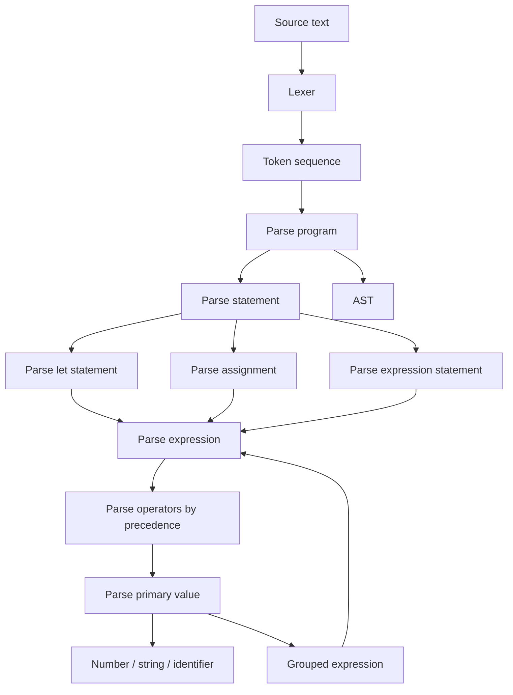

# Recursive Descent Parser Guide

A recursive descent parser is a group of small parsing routines. Each routine understands one grammar rule, consumes the tokens belonging to that rule, and produces an AST node.



The recursion appears near the bottom: parsing `(expression)` requires parsing another expression, which can contain another `(expression)`, and so on.

## 1. The parser's state

The parser needs to remember:

- The token array
- The index of the current token
- The original source text, if AST nodes need to copy or reference token text
- Any parsing errors collected so far

Think of the parser as having a finger pointing at one token:

```text
LET  IDENTIFIER  =  NUMBER  +  NUMBER  NEWLINE
 ^
 current
```

Every parsing operation either:

- Inspects the current token
- Consumes it and advances
- Calls another parsing routine
- Creates an AST node
- Reports an unexpected token

The golden rule is: every successful parsing routine must leave the cursor on the first token it did not consume.

## 2. Grammar rules become parsing routines

Write down a small grammar before implementing the parser. For the first milestone, it could conceptually be:

```text
program          -> separators* (statement separators+)* statement? EOF
statement        -> letStatement | assignmentStatement | expressionStatement
letStatement     -> "let" IDENTIFIER "=" expression
assignment       -> IDENTIFIER "=" expression
expressionStmt   -> expression
separators       -> NEWLINE | SEMICOLON
```

This notation is not implementation code. It describes which token patterns are legal.

Each named grammar rule roughly corresponds to one parsing routine:

```text
program          <-> parse_program
statement        <-> parse_statement
letStatement     <-> parse_let_statement
expression       <-> parse_expression
```

## 3. Parsing a program

The program parser owns the outer loop:

1. Skip blank lines.
2. If the next token is EOF, finish.
3. Parse one statement.
4. Add that statement to the program node.
5. Require a newline, semicolon, or EOF.
6. Repeat.

Blocks will eventually use almost the same process, except they stop at `}` instead of EOF.

This is an important pattern: both a file and a block are lists of statements.

## 4. Choosing the statement type

The statement parser examines the next few tokens and delegates:

- `let` means parse a let statement.
- An identifier followed immediately by `=` means parse an assignment.
- Anything else begins an expression statement.

This is called lookahead. You are not consuming tokens yet; you are inspecting enough tokens to choose the correct grammar rule.

For example:

```text
let x = 10       -> let statement
x = 20           -> assignment statement
print(x)         -> expression statement
x + 20           -> expression statement
```

Avoid putting the entire parser into one giant `switch`. The statement parser should choose a specialized routine, and that routine should handle the details.

## 5. Parsing a let statement

Given:

```text
let answer = 2 + 3
```

The let parser conceptually does this:

1. Require and consume `let`.
2. Require and consume an identifier.
3. Require and consume `=`.
4. Ask the expression parser to parse everything on the right.
5. Create a let-statement node containing the identifier and expression.

Notice that the let parser does not need to understand `2 + 3`. It delegates that responsibility.

That delegation is the core idea behind recursive descent.

## 6. Expression precedence

Expressions need several parsing levels so precedence works correctly. A suitable hierarchy is:

```text
expression
└── logical OR
    └── logical AND
        └── equality: == !=
            └── comparison: < <= > >=
                └── term: + -
                    └── factor: * / %
                        └── unary: ! -
                            └── postfix: calls and member access
                                └── primary: literals, names, (...)
```

Each level parses operands by calling the level beneath it.

For:

```text
2 + 3 * 4
```

The `+` level asks the `*` level for its operands. The `*` level groups `3 * 4` first, producing:

```text
      +
     / \
    2   *
       / \
      3   4
```

That tree represents:

```text
2 + (3 * 4)
```

You get correct precedence from the structure of the parsing routines, not from fixing the tree afterward.

## 7. Where the recursion happens

Consider:

```text
2 * (3 + 4)
```

The flow is roughly:

```text
parse expression
  -> parse multiplication
    -> parse primary: 2
    -> sees *
    -> parse primary: (
      -> parse expression again for 3 + 4
      -> require )
```

The grouped-expression parser calls the expression parser again. That expression could contain another group:

```text
2 * (3 + (4 * 5))
```

The recursion naturally continues until it reaches basic values such as numbers or identifiers.

## 8. Building the AST while returning

Parsing calls descend toward simple tokens, then build nodes while returning upward.

For:

```text
let result = 2 + 3 * 4
```

The construction order is approximately:

1. Create the node for `2`.
2. Create the node for `3`.
3. Create the node for `4`.
4. Combine `3` and `4` into a multiplication node.
5. Combine `2` and that multiplication node into an addition node.
6. Put that expression into the let-statement node.
7. Put the let statement into the program node.

The resulting AST is:

```text
Chunk
└── Let statement
    ├── Identifier: result
    └── Binary: +
        ├── Number: 2
        └── Binary: *
            ├── Number: 3
            └── Number: 4
```

## 9. Newline handling

With Kivo's chosen rules:

- Program and block parsing treat newlines as statement separators.
- Normal expression parsing stops when it encounters a newline.
- A grouping parser may skip newlines before parsing its contents and before expecting the closing symbol.

Therefore, this is invalid:

```text
let x = 1 +
    2
```

But this is valid:

```text
let x = (
    1 +
    2
)
```

The lexer should still emit all newline tokens. The parser knows whether it is currently inside a grouping construct.

## 10. A sensible implementation order

Build and manually test one layer at a time:

1. Token cursor operations: inspect, advance, match, and require.
2. Program node containing multiple statements.
3. Literal and identifier expressions.
4. Parenthesized expressions.
5. Unary operators.
6. Multiplication and division.
7. Addition and subtraction.
8. Comparisons and equality.
9. Let statements.
10. Assignments.
11. Calls and member access.
12. Blocks and control flow.

Do not start with `if`, loops, functions, or tables. If `let result = 2 + 3 * 4` produces the correct tree, the central machinery of the parser is working.
